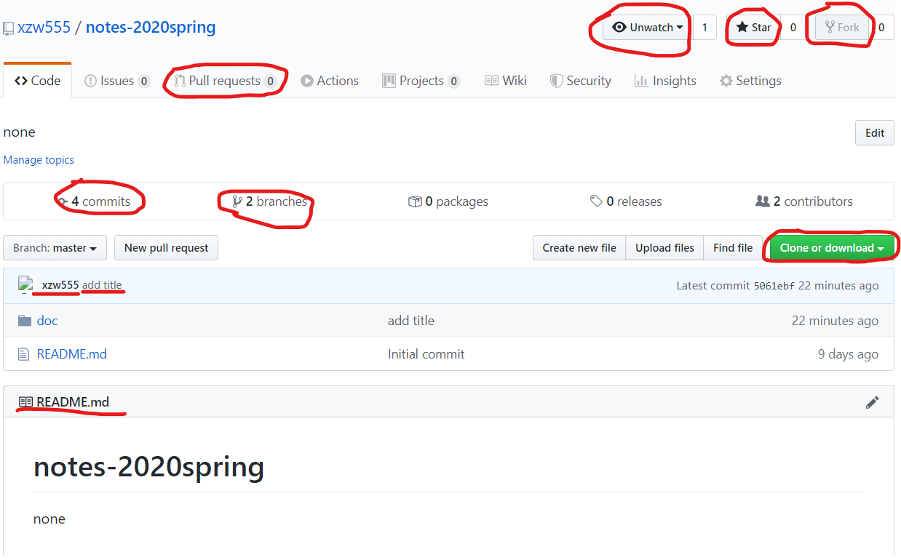

# 20200410 讨论
```bash
21:30-23:30
周智维，徐智为
```
## 主要内容
* python学习记录回顾
    * print用法错误
    * is 和 == 区别
    * python中集合的概念
    * python及pycharm的规范格式(可以用reformat快速调整)
    * python编程自顶向下编程思路
* github教学
    * 认识github界面
        * fork, commits, pull request, clone or download等的含义
        * 
    * 建立一个库存放平时的代码，文档(https://github.com/xzw555/notes-2020spring)
    * 下载github desktop
        * 认识desktop界面
        * 介绍commit to master，push origin，fetch origin
        * 网站中README.md可以直接在文件夹下渲染出来
        * 如何在本地和远端更改文档并同步
* 本周任务
* 继续看python教学视频